# Pocket Arcade

A 3D arcade for Android that you walk around in. Stroll a blacklight-carpeted arcade floor with a floating joystick, past banks of claw machines, skee-ball alleys, linked racers and a coin-pusher island. Step up to a glowing cabinet, spend a token, and the camera dives into the machine's screen. Play a 40–60 second round, watch your tickets print out of the slot, then trade them at the prize counter for hats, outfits and decorations that show up in the hall.

Everything is made in code. The hall and every machine are rendered on the GPU with OpenGL ES 3 at full resolution: per-pixel lighting from dozens of coloured lights, 4× anti-aliasing and a bloom glow on neon and screens. Every model, texture, font glyph and sound is generated at runtime. Textures are painted with Android's 2D canvas, and sounds are synthesized through `AudioTrack`. The app ships no image or audio files and uses no third-party libraries beyond AndroidX/Compose.

<p>
  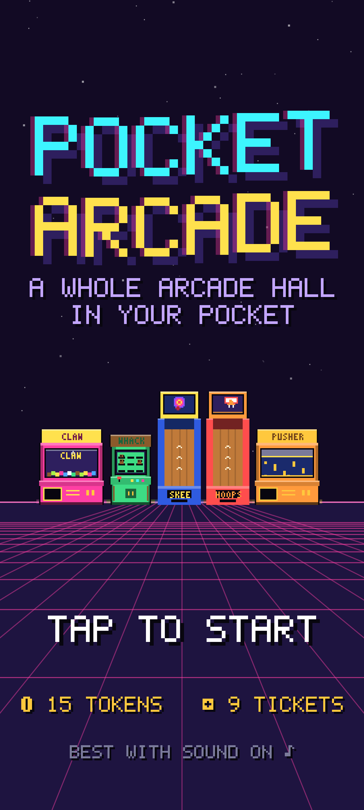
  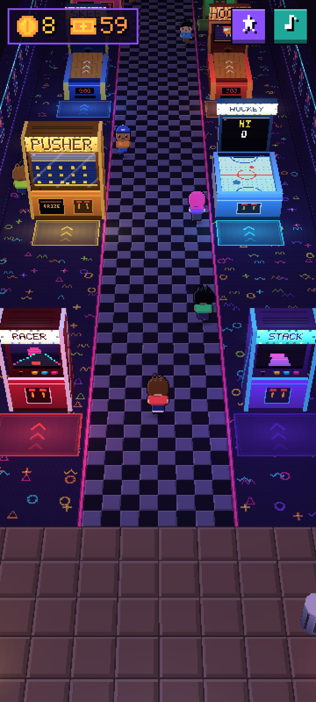
  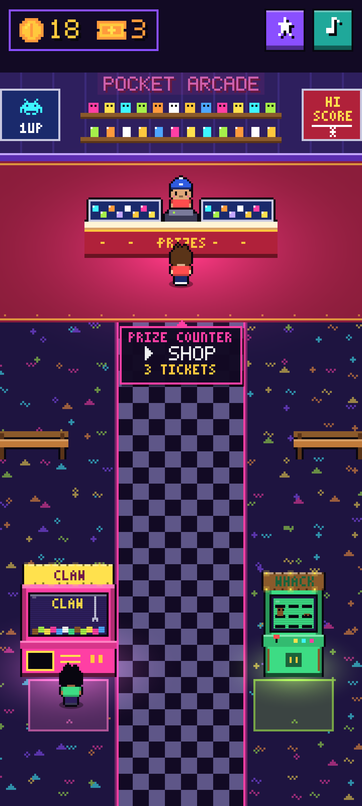
  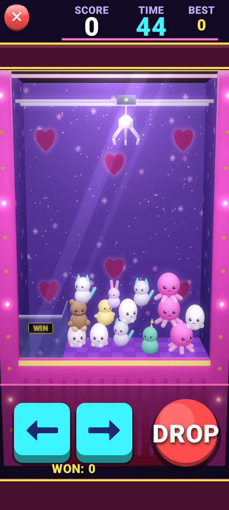
  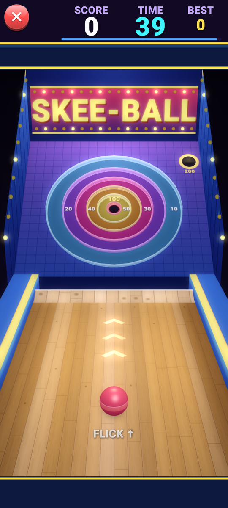
</p>
<p>
  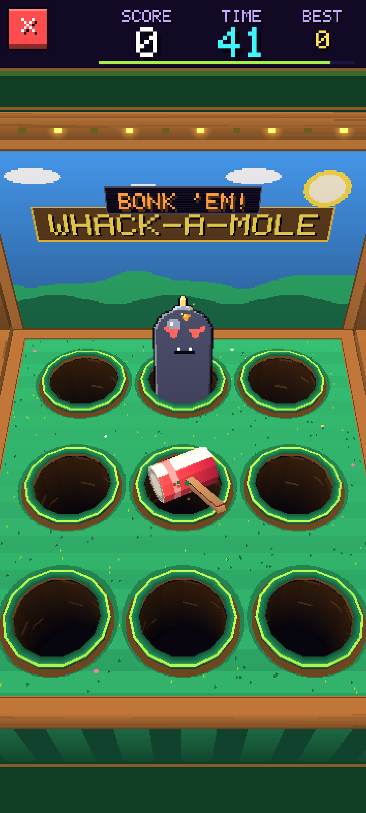
  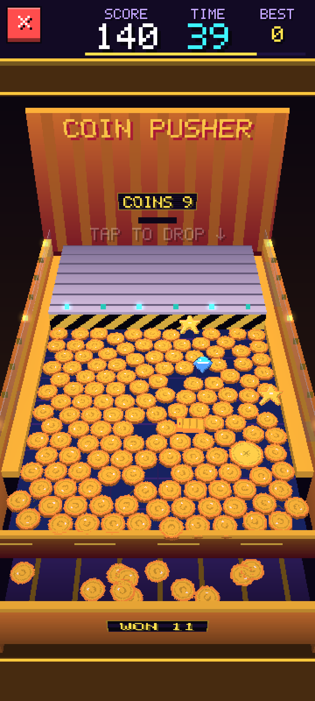
  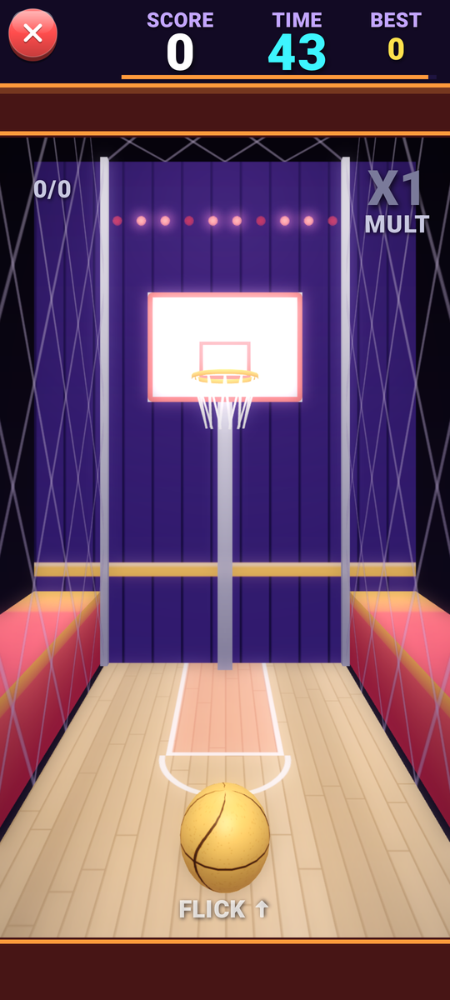
  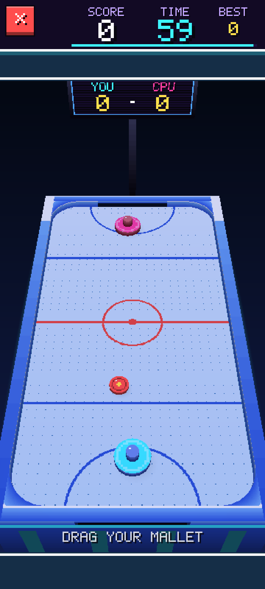
  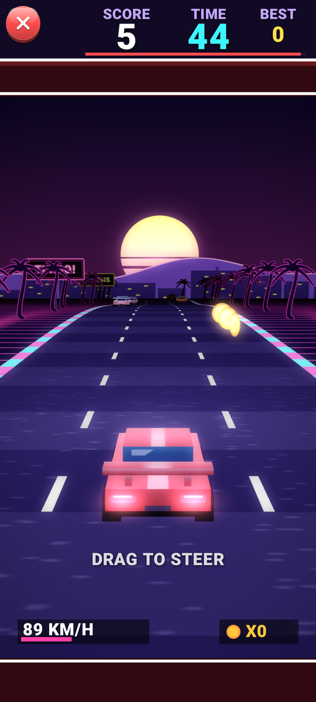
  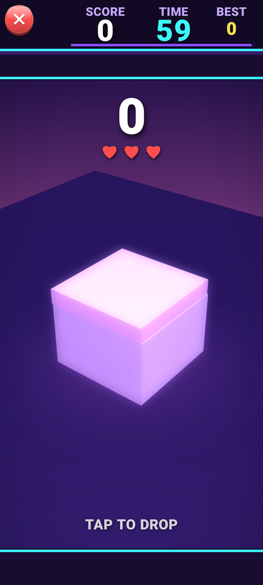
</p>

## Features

**The hall**
- A real arcade floor plan:
  - at the back, a prize counter with a wall of plushies, flanked by banks of claw machines and stackers;
  - across the floor, skee-ball and basketball alleys, air hockey tables, a whack-a-mole row, a four-machine coin-pusher island and linked racers in the middle;
  - around the edges, a snack bar with café tables and vending machines, and a photo booth;
  - by the doors, a token kiosk and kiddie rides.
- Every cabinet is modelled for its game, from glass claw boxes with a working gantry to long lanes, basketball cages, racer seats and pusher shelves that sweep. Each has a live attract-mode screen, a marquee with chasing bulbs, a neon glow and its own coloured light.
- Blacklight carpet, terrazzo at the entrance, walls rising into the dark with acoustic panels, uplights and a backlit mural, and the street outside through the cut-away shopfront.
- 3D kids with a walk cycle, poses for playing, cheering and sitting, and hats. Yours follows a floating joystick that appears wherever your thumb lands. The other kids find their way between machines, play them and sit down at the snack bar.
- Collision against walls, cabinets and furniture, with sliding along edges.
- Walk up to a machine and a **▶ PLAY (1 token)** prompt pops up. Tap it and the camera flies into the cabinet's screen. Exiting flies you back out to exactly where you stood.
- An ambient arcade soundscape: mains hum, crowd murmur and distant machine bleeps.

**Eight machines**, each a full 3D game that pays out tickets:
1. **Claw machine**: a glass box full of 3D plushies, with a gantry and a claw that swings on its cable (a real variable-length pendulum), with hinged prongs that open and close. Prizes are a physics pile. Whether a prize holds depends on the machine's grip for that grab and how centred you were, and it can slip on the way up. Now and then you get a gold **lucky claw** turn. Prizes you win go into your plush collection (11 to find, including a rare golden cat).
2. **Skee-ball**: a player's-eye alley with a tilted target board and raised ring walls. Drag the ball to aim, then flick up. Flick speed sets how far it jumps. Rings are worth 10–100, with a 200-point bonus hole in the corner.
3. **Whack-a-mole**: a table with real holes. Moles, golden moles and bombs rise out of them and you bonk them with a 3D mallet. It speeds up as the round goes on, and hits in a row build a combo.
4. **Coin pusher**: tap to drop coins onto a packed deck while the shelf sweeps back and forth. Coins that spill over the lip land in the win tray. Gems, big coins, ticket bundles and coin-shower stars are mixed in, and five spills in quick succession trigger an avalanche bonus.
5. **Hoop shot**: flick to shoot at a real 3D rim, net and backboard, with rim bounces and banks. Makes in a row multiply your points up to ×5, and the hoop starts moving in the second half.
6. **Air hockey** (new): drag your mallet and smash the puck past the CPU on an air table with rounded corners. The CPU speeds up as you pull ahead. Goals in a row score more, and the first to 7 wins.
7. **Turbo racer** (new): a synthwave road race into the sunset. Drag to steer through curves and over hills, dodge traffic, skim past cars for bonus points and grab tokens off the road.
8. **Stacker** (new): tap to drop each sliding slab onto the tower. Any overhang is cut off and tumbles away. Line one up perfectly to keep it whole and build a combo. You get three misses.

**Game feel**
- Screen shake, particles, squash and stretch, popping score text and a 3-2-1-GO countdown.
- Ticket strips print out of each machine with a counter ticking up; tap to skip.
- Haptics on hits, wins and jackpots.
- A high score for every machine, shown on the cabinet screens in the hall. Beating one sets off confetti and a fanfare.
- Smooth type with vector icons for tokens, tickets and stars, glossy arcade buttons, and one bright palette across the whole app.
- The prize counter shows each prize as a 3D model on a turntable, photographed by the GPU.

**Progress** is saved with DataStore: tokens, tickets, prize collection, owned and equipped cosmetics, bought decorations, high scores and the daily refill date.

- You start with **20 tokens** and get **10 free every day**.
- The token machine trades **40 tickets for 1 token**. If you are completely out, you can grab a free spare token every 3 minutes, so tokens never run out for good.

## The 3D engine

`engine/r3d` records scenes and `engine/gl` draws them with OpenGL ES 3:

- **Threads.** Each screen records a frame of textured polygons and model instances on the UI thread. A dedicated GL thread draws it into a `TextureView` under the Compose UI.
- **Geometry.** Static models live on the GPU as vertex buffers and draw as instances. Polygons are sorted into opaque, alpha-blended and additive passes, so glass, glows, neon and sparks all work.
- **Lighting.**
  - Per-pixel: ambient, one directional light and up to 64 coloured point lights. A light grid across the floor keeps the many lights cheap.
  - Glossy highlights, darkening fog and filmic tone mapping.
- **Models.** They are built from boxes, cylinders, lathes, spheres, capsules and tori, and move as jointed parts: the claw's prongs, the mallet's swing, the kids' limbs.
- **Image quality.**
  - Scenes render with 4× multisampling, alpha-to-coverage for cut-outs, a bloom glow and a vignette.
  - The render resolution eases down if frames run long.
- **Textures.** They are painted with Android's `Canvas` (gradients, real fonts, glows and grain). A texture can be stored at a finer resolution than the texel size the code maps it in.
- **Stage3D.** Gives each game a 3D view that maps touches onto world planes and world points back to the screen.

## Install the APK on your phone

Every push to `main` builds a debug APK and publishes it as a GitHub Release.

1. On your Android phone (Android 8.0 or newer), open **https://github.com/gh00ul/pocket-arcade/releases/latest**.
2. Tap **PocketArcade.apk** to download it.
3. Open the download. If Android asks, allow your browser to *install unknown apps*, then tap **Install**.

All builds are signed with the same key (`app/debug.keystore`), so newer builds install over older ones and keep your progress.

## Build it yourself

You need JDK 17 or newer and the Android SDK with platform 36.

```bash
./gradlew assembleDebug
```

The APK lands in `app/build/outputs/apk/debug/app-debug.apk`. Install it with `adb install -r app/build/outputs/apk/debug/app-debug.apk`, or open the project in Android Studio and press Run. The debug build is compiled non-debuggable, because recording each 3D frame needs ART's optimising compiler to hit 60 fps. The phone needs OpenGL ES 3.0, which nearly every phone running Android 8.0 or newer supports.

To jump straight into a machine (it still costs a token), pass its id:

```bash
adb shell am start -n com.pocketarcade/.MainActivity --es play racer
```

The ids are `claw`, `whack`, `skeeball`, `hoops`, `pusher`, `airhockey`, `racer` and `stacker`. To log frame times, run `adb shell setprop log.tag.PocketArcade3D DEBUG` and restart the app.

The headless payout simulation plays every machine with bots of different skill and prints average tickets per round:

```bash
./gradlew testDebugUnitTest
```

## Add a new machine

Write one class and register it in one place. The hall gives it a cabinet, a play mat, a prompt, a high-score table and an attract screen automatically, and grows a new row when it needs room.

1. Create `app/src/main/java/com/pocketarcade/games/<name>/<Name>Game.kt` and extend `BaseMiniGame`, which implements the `MiniGame` interface and provides particles, screen shake, popups, a score and a round clock. Draw with a `Stage3D`, or straight onto the Compose `DrawScope` for a flat game:

```kotlin
class BowlingGame : BaseMiniGame() {
    override val id = "bowling"                 // save key for the high score: never change it
    override val title = "BOWLING"              // intro card and results
    override val marquee = "BOWL"               // up to 6 characters, printed on the cabinet
    override val instructions = listOf("FLICK THE BALL", "KNOCK DOWN THE PINS")
    override val look = CabinetLook(body = Pal.TEAL, trim = Pal.WHITE, glow = Pal.CYAN, shape = CabinetShape.LANE)
    override val roundSeconds = 45f

    private val stage = Stage3D(GAME_W.toInt(), GAME_H.toInt()).apply {
        look(180f, 200f, 700f, 180f, 0f, 100f, fovDeg = 45f)   // camera eye, target, field of view
    }

    override fun reset() { /* set up a fresh round */ }
    override fun step(dt: Float) { /* fixed 1/120 s simulation step; call addScore(...) */ }
    override fun render(scope: DrawScope) {
        val r = stage.begin()
        // r.quad(...), r.sprite(...), model.draw(r, xf = ...) and so on
        stage.present()
    }
    override fun onTouch(type: TouchType, id: Long, x: Float, y: Float, timeMs: Long) {
        // x, y are field units (360 x 640); stage.touchToPlane(x, y, 0f, out) finds the spot in the world
    }
    override fun ticketsFor(score: Int) = 1 + score / 20
    override fun drawAttract(p: Painter, w: Int, h: Int, time: Float) { /* tiny cabinet screen */ }
}
```

2. Add it to the list in `games/GameRegistry.kt`:

```kotlin
fun createAll(): List<MiniGame> = listOf(
    ClawMachineGame(), WhackAMoleGame(), SkeeBallGame(), HoopsGame(),
    CoinPusherGame(), AirHockeyGame(), RacerGame(), StackerGame(),
    BowlingGame(),
)
```

That's all. The host takes care of the intro card, countdown, timer, pause/quit, results, ticket printing, token spending and saving. Override `isSettled()` if your round has things still in motion after the clock runs out, and set `endedEarly = true` to finish a round before the clock does.

## Project layout

```
app/src/main/java/com/pocketarcade/
├── MainActivity.kt        single activity: immersive, portrait, audio lifecycle, launch shortcut
├── ArcadeApp.kt           title → hall ↔ machine flow and the camera dive transitions
├── engine/                fixed-step loop, touch/flick tracking, circle physics, audio synth,
│   │                      particles, shake/springs, haptics, the game's type and icons
│   ├── r3d/               scene recorder, camera, lighting, models, painted textures, Stage3D
│   └── gl/                OpenGL ES 3 thread, renderer, shaders and the render surface
├── hub/                   hall floor plan, scene, cabinets, fixtures, 3D kids, camera, joystick
├── games/                 MiniGame interface, BaseMiniGame, GameRegistry
│   ├── claw/  skeeball/  whackamole/  coinpusher/  hoops/
│   └── airhockey/  racer/  stacker/
├── data/                  DataStore repository, save state, prize catalog
└── ui/                    HUD, title, prize counter, token machine, profile, game host, widgets,
                           and the thumbnail studio
```

Tuning knobs for every game (difficulty and payouts) are grouped at the top of each game file in a `*Tuning` object: `ClawTuning`, `SkeeTuning`, `WhackTuning`, `PusherTuning`, `HoopsTuning`, `HockeyTuning`, `RacerTuning` and `StackerTuning`.
