# Pocket Arcade

A 3D arcade for Android that you walk around in. Stroll a blacklight-carpeted arcade floor with a floating joystick, from overhead or in first person at a kid's eye height, past banks of claw machines, skee-ball alleys, linked racers, light-gun cabinets, pinball tables, fishing tubs and a coin-pusher island. Step up to a glowing cabinet, spend a token, and the camera dives into the machine's screen. Play a 40–75 second round, watch your tickets print out of the slot, then trade them at the prize counter for hats, outfits and decorations that show up in the hall.

Everything is made in code. The hall and every machine are rendered on the GPU with OpenGL ES 3: per-pixel lighting from dozens of coloured lights with rim light, 4× anti-aliasing, a multi-scale bloom glow on neon and screens, and colour grading. Every model, texture, font glyph and sound is generated at runtime. Textures are painted with Android's 2D canvas, and sounds are synthesized through `AudioTrack`. The app ships no image or audio files and uses no third-party libraries beyond AndroidX/Compose.

<p>
  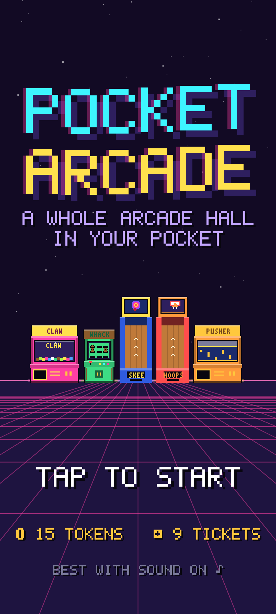
  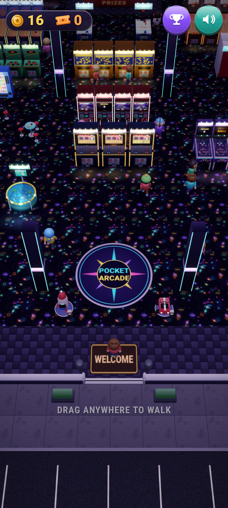
  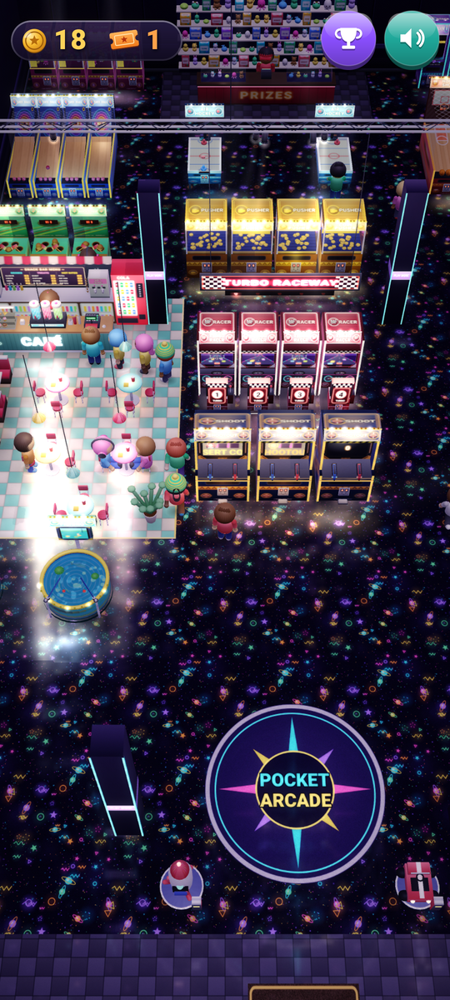
  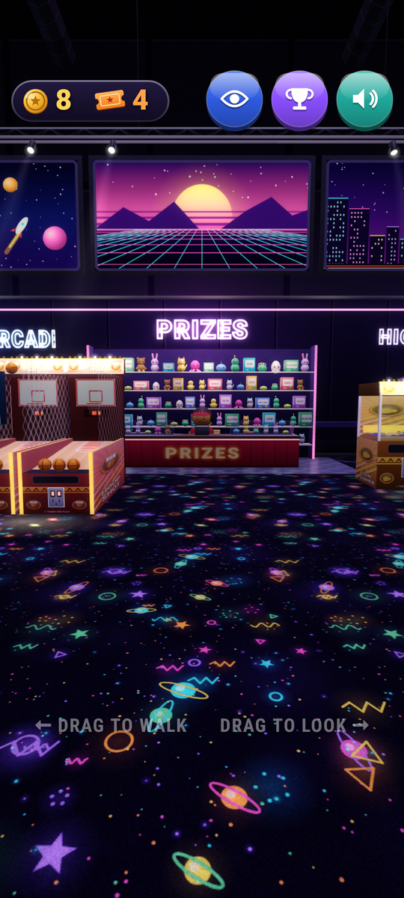
  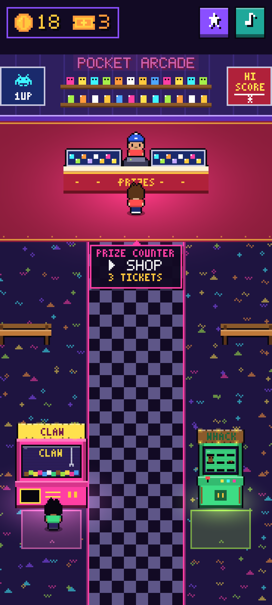
  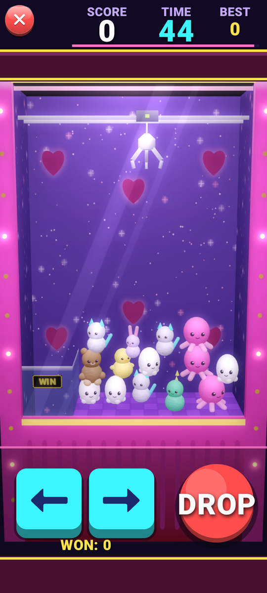
  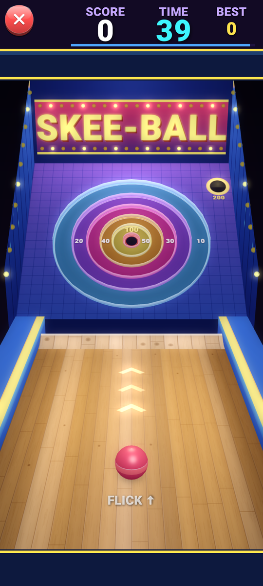
</p>
<p>
  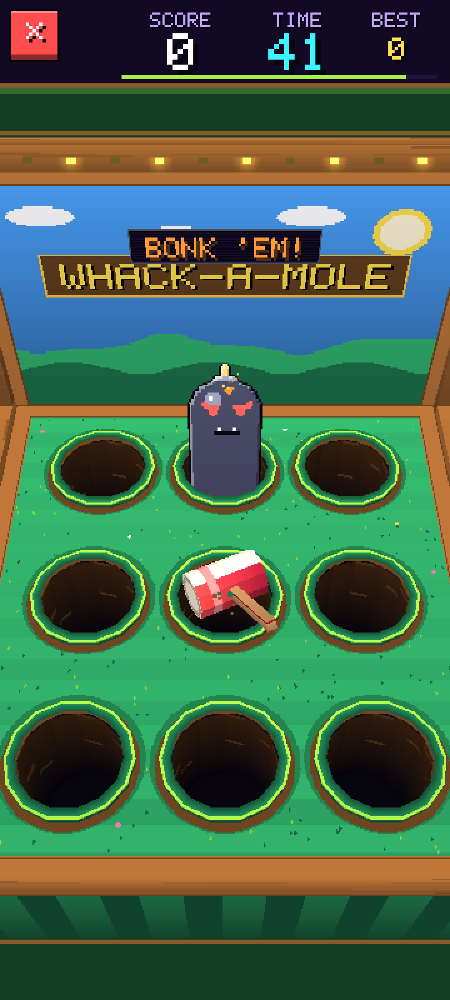
  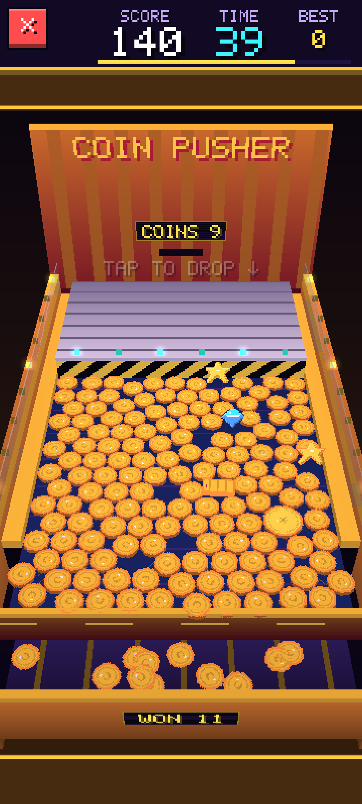
  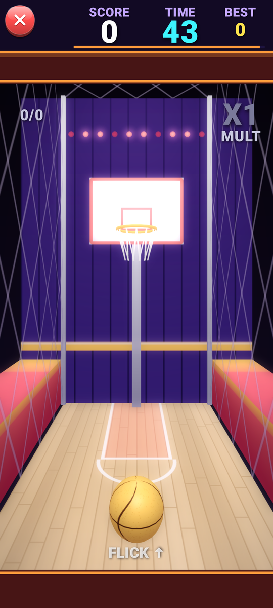
  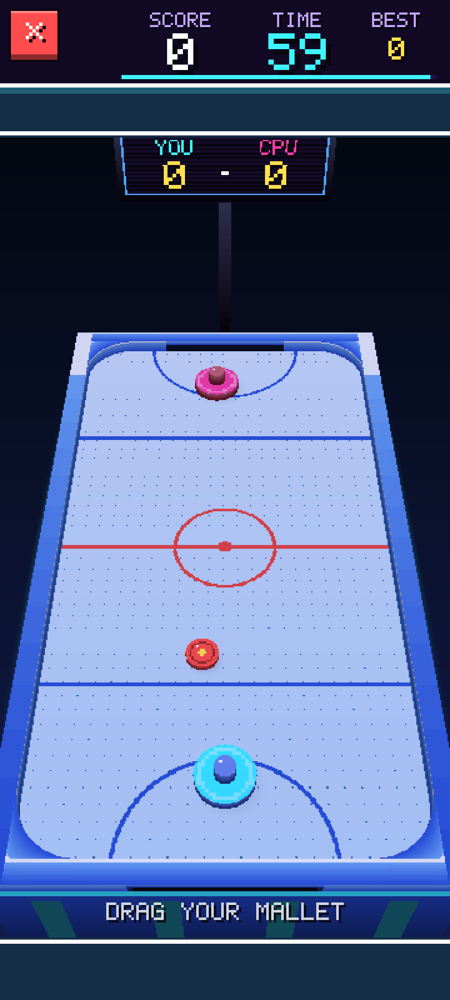
  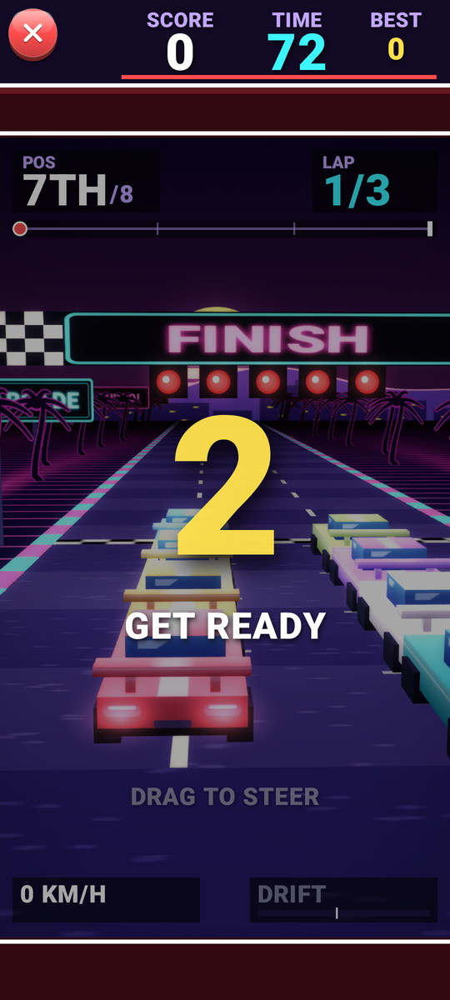
  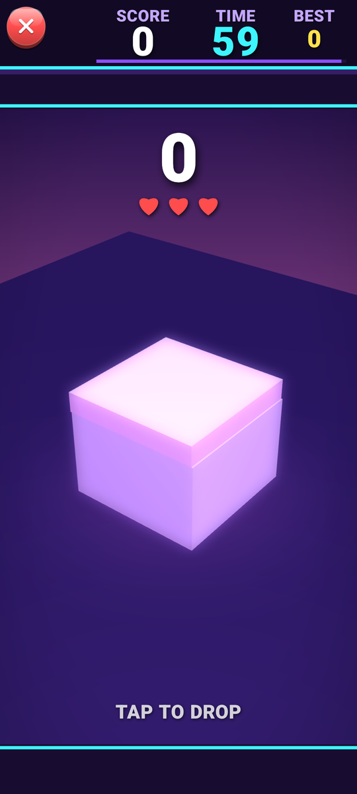
</p>
<p>
  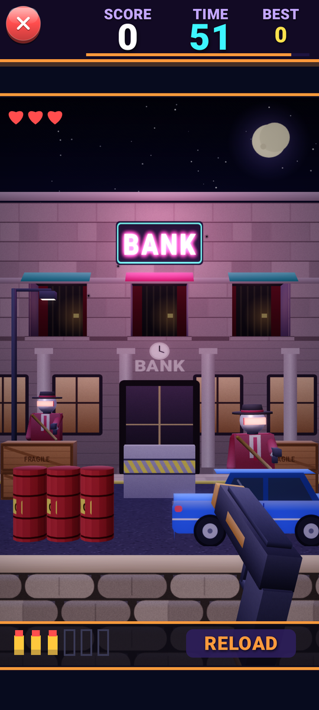
  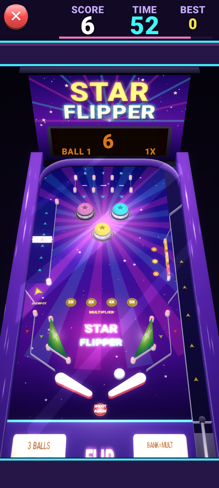
  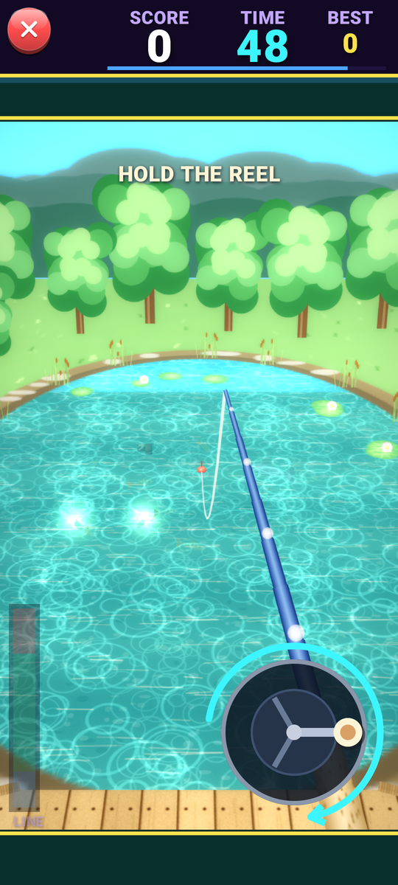
</p>

## Features

**The hall**
- A real arcade floor plan: a wide main aisle runs straight from the doors to the prize counter, with rows of banks either side facing the doors across cross aisles, and a neon sign on the wall over each zone:
  - at the back, a prize counter with a wall of plushies, flanked by banks of claw machines and stackers;
  - then the ticket games: skee-ball and basketball alleys side by side, and a four-machine coin-pusher row under a JACKPOT sign;
  - the table games: whack-a-moles and air hockey tables, and pinball tables along the right wall;
  - the video games: linked racers under their hung sign and light-gun cabinets, fronts in line across the aisle;
  - the family floor by the entrance: fishing tubs, kiddie rides, a photo booth, and the token kiosk just inside the doors;
  - in the front-left corner, open to the main aisle, a café: a service counter with a pastry case, slushie and soft-serve machines, a lit menu board and a neon sign, vending machines, diner booths and tables under pendant lamps, on a checked tile floor;
  - two spare banks, beside the pinball tables and on the family floor, ready for new machines.
- Every cabinet is modelled for its game, from glass claw boxes with a working gantry to long lanes, basketball cages, racer seats and pusher shelves that sweep. Each has a live attract-mode screen, a backlit marquee and topper with the game's emblem, painted side art, a lit coin door, chasing bulbs, a neon glow and its own coloured light. Bodies, side panels, rails and backboards have chamfered edges that catch the light and paint that darkens towards the floor, so the cabinets sit in it.
- A lighting rig: trusses and wall rails with spotlights that throw beams through the haze and coloured pools in front of every bank, backlit murals, a hung TURBO RACEWAY sign with start lights, and chase bulbs round the entrance.
- Blacklight carpet that fluoresces, terrazzo at the entrance, walls rising into the dark with acoustic panels, uplights and a backlit mural, and the street outside through the cut-away shopfront.
- 3D kids with a walk cycle, poses for playing, cheering and sitting, and hats. Each throws a soft shadow away from the lamps above (a stripe for legs and torso, a disc for the head, and a blob under the feet) that swings smoothly as they walk between lights. Yours follows a floating joystick that appears wherever your thumb lands. The other kids find their way between machines, play them, queue at the café till and sit down with a drink or a cone. A barista wipes the counter and makes each order at the slushie, espresso or soft-serve station.
- **First person.** The eye button next to the trophy switches between the overhead camera and a kid's-eye view, easing between the two. In first person the left thumb walks (forward, back and strafe), the right thumb drags to look, and your choice is remembered. Up close the hall is finished on every side: closed cabinet backs with service panels, a ceiling of acoustic tiles, light panels, ducts and sprinklers, and a glass shopfront onto the street.
- **Run lock.** In first person, push the stick to its rim to lock a run: ease your thumb off and keep running until you lift it or come back under half a push. A ring and RUN on the stick show it's locked. (Settings can go back to running only while the thumb is at the rim.)
- **Tap to walk, in either view.** Tap a machine, the token kiosk, the prize counter or a patch of floor and your kid walks there and turns to face it. Touching the stick takes over at once.
- **Map.** The map button (under the trophy) opens the floor plan: props as tinted boxes, a marker for every machine in its neon colour and marquee text, the café, the token kiosk, the prize counter and the doors, and a pulsing dot where you stand. Tap a place and your kid walks there.
- **Settings.** The gear button opens look speed, invert look, left-handed (the walk and look halves swap), first-person field of view, run mode, racer tilt steering, reduce motion (no head bob, run zoom, screen shake, slow motion, camera punch or flashes, title and handoff camera moves, and the interface stops sliding and overshooting), haptics with a strength stepper, effects and ambience volume, graphics quality (auto, battery or best) and frame rate (auto, 30 or 60), and a HELP row that replays the tutorial.
- **The title.** A full-screen showroom of every machine on a polished floor before a stage wall, lit by hanging spotlights through the haze. The camera rides a closed spline (`hub/ShowroomPath.kt`, a Catmull-Rom loop of keyframes, low and oblique along the row and craning back over it) instead of orbiting. The neon sign lights letter by letter with a stutter, breathes, gets a light sweep and the odd buzz; dust motes and stars parallax with the camera; TAP TO START pulses; a welcome line and the version sit under it. The timelines are pure functions in `ui/TitleTimeline.kt`. With reduce motion the camera holds one shot and the sign fades in as one.
- **Title to hall.** Tapping start pushes the camera in while the sign lifts away, dips through a warm doorway of light to dark, then the hall comes up out of the dark with its camera pulled back and pushing gently in to rest (`HubCamera.entrance`), and the interface fades in last. `TitleHandoff` (`ui/Handoff.kt`) plays it in one coroutine; a loading step goes in its `gate` argument, which runs while the screen is fully dark. Reduce motion gets short crossfades.
- **First run.** A new player (no rounds played yet, and no `tutorial_done` unlock in the save) gets a short guided tour once, after first arriving in the hall: walk, look (first person), play a machine, visit the prize counter. `Tutorial` (`ui/TutorialSteps.kt`) is a pure step machine that advances only when the player does the thing; the coach card, ghost touch and arrow (`ui/Onboarding.kt`) never block input, and the card can skip a step or end the tour. Finishing or ending it saves `unlock("tutorial_done")`; Settings replays it any time.
- **Daily bonus.** The free tokens arrive as a card once the hall is quiet: tokens tumble in with a flip and a bounce, a +N counter ticks as each lands (`ui/DailyBonus.kt`).
- Collision against walls, cabinets and furniture, with sliding along edges.
- Walk up to a machine and a **▶ PLAY (1 token)** prompt pops up, and the cabinet you're standing at (or the token kiosk, or the prize counter) glows a little brighter and pulses gently, with its floor light pool swelling, fading in and out as you step up and away. Tap the prompt and the camera flies into the screen of the cabinet you're standing at. Exiting flies you back out to exactly where you stood (in first person, facing the machine).
- **The prize wall shows what you've won.** The plushies on the shelves behind the counter are in colour once you've won them from the claw machine, and dark silhouettes until then.
- **The photo booth** by the doors opens from its own prompt: your kid in their current hat and outfit, a 3-2-1 countdown, then four shots in four poses (idle, cheer, sit, cheers with a drink). The strip is composed under your arcade's name and the date, saved in the app's own storage (the last four are kept) and can be sent through the Android share sheet. It asks for no storage permission. The kept strips hang as posters on the photo wall on the wall above the booth (blank "PHOTO WALL" frames until there are some), repainted into a live texture whenever a new one is saved.
- The photo booth, kiddie rides, vending machines, café counter and bought trophy case, fish tank and jukebox all show a prompt when you stand at them. Only the photo booth does anything yet; the rest say COMING SOON (see "Add an interactive prop").
- An ambient arcade soundscape: mains hum, crowd murmur and distant machine bleeps.

**Eleven machines**, each a full 3D game that pays out tickets:
1. **Claw machine**: a glass box full of 3D plushies, with a gantry and a claw that swings on its cable (a real variable-length pendulum), with hinged prongs that open and close. Prizes are a physics pile. Whether a prize holds depends on the machine's grip for that grab and how centred you were, and it can slip on the way up. Now and then you get a gold **lucky claw** turn. Prizes you win go into your plush collection (11 to find, including a rare golden cat).
2. **Skee-ball**: a player's-eye alley with a tilted target board and raised ring walls. Drag the ball to aim, then flick up. Flick speed sets how far it jumps. Rings are worth 10–100, with a 200-point bonus hole in the corner.
3. **Whack-a-mole**: a table with real holes. Moles, golden moles and bombs rise out of them and you bonk them with a 3D mallet. It speeds up as the round goes on, and hits in a row build a combo.
4. **Coin pusher**: tap to drop coins onto a packed deck while the shelf sweeps back and forth. Coins that spill over the lip land in the win tray. Gems, big coins, ticket bundles and coin-shower stars are mixed in, and five spills in quick succession trigger an avalanche bonus.
5. **Hoop shot**: flick to shoot at a real 3D rim, net and backboard, with rim bounces and banks. Makes in a row multiply your points up to ×5, and the hoop starts moving in the second half.
6. **Air hockey**: drag your mallet and smash the puck past the CPU on an air table with rounded corners. The CPU speeds up as you pull ahead. Goals in a row score more, and the first to 7 wins.
7. **Turbo racer**: a three-lap synthwave race against seven rivals on a closed circuit. Start from the grid under the start lights, drag to steer through the bends and over the hills, and hold the DRIFT button (low on the right, or a second finger anywhere) to drift through corners and charge a turbo. It can also be steered by tilting the phone (`RacerGame.tiltSteering`, off by default): the phone's level is taken at the start of the race and after a pause, and any held finger then drifts. Rivals take racing lines, overtake and bump. A live position and lap counter tracks the race, and you're paid for your finishing place, clean passes and time left.
8. **Stacker**: tap to drop each sliding slab onto the tower. Any overhang is cut off and tumbles away. Line one up perfectly to keep it whole and build a combo. You get three misses.
9. **Shootout** (new): a light-gun cabinet with two mounted pistols. Tap to shoot exactly where you tap. Targets pop out of cover and fly in: red-ringed gunmen fire back, gold drones are rare and pay big, and hands-up civilians must not be shot. Six shots, then tap the reload bar. Hits in a row build a combo, accuracy pays a bonus, and the round ends with a boss.
10. **Star Flipper** (new): a pinball table seen down the glass. Hold the left or right half of the screen to flip, pull the plunger down and let go to launch, and nudge with a swipe up (don't tilt). Pop bumpers, slingshots, drop targets for a multiplier and three top lanes that light multiball.
11. **Gone Fishing** (new): a round pond tub. Hold on the pond to charge a cast and let go at the right power, strike when the bobber dives, then draw circles on the reel to wind the fish in. Ease off when it pulls, or the line snaps. Bigger and rarer fish, up to a golden one, are worth more.

**Game feel**
- Screen shake, particles, squash and stretch, popping score text, and a countdown whose numerals drop in, overshoot and roll a ring outward, ending in a GO! that swells as it fades.
- **Time and camera.** A game asks, the host decides: `GameFx.hitStop` freezes the round for a few frames on a big hit, `GameFx.slowMo` eases it down to about 0.3-0.5× for a beat (jackpot, last-second win), and `GameFx.punch` kicks the 3D camera in with a spring (a tighter lens and a small dolly, then a soft overshoot back). The host paces this in `TimeScale` and `SimClock`: the round clock and the game slow together but the game still steps by exactly `FIXED_DT`, so headless simulations and payouts never see a scaled time. Freezes are at most 0.12 s and slow motion at most 0.9 s, each followed by a cooldown, and only the playing phase (and the results) are ever slowed. With reduce motion on there is no slow motion, hit-stop, camera punch or flash.
- **Results reveal.** The card drops in, the score counts up with rising ticks, then the best line lands (a new high score is a slam: a short freeze, slow-motion confetti, a camera punch and a flash), the round is stamped with a grade (S, A, B or C, from the score against the player's best and the ticket haul against a par, with no change to the economy), and only then do the tickets print. The tickets arc from the printer into a counter that climbs as each one lands, and PLAY AGAIN and EXIT pop in when printing is done. A tap after the first half second jumps to the printing.
- **Counters and currency.** The HUD's token and ticket counts roll like an odometer (digits slide over each other, with a soft tick and a small pop as they rise), the token count breathes when two or fewer are left, a token flies out of the counter toward the machine you enter, and the HUD fades out and in under a dive instead of popping.
- **Springy interface.** Buttons sink, shrink and brighten under your finger and spring back past rest; panels fade their scrim in, lift their card in with a small overshoot and slide each inset box in turn; the intro and pause cards arrive piece by piece; the top banner drops in on a spring and fades away.
- Ticket strips print out of each machine with a counter ticking up; tap to skip.
- Haptics on hits, wins and jackpots, built from the phone's haptic-engine primitives (click, tick, thud) where it has them and plain buzzes where not, and played as touch feedback from Android 13 so the system's setting applies. `Haptics.strength` scales them all. The hall gives a soft tick when a play prompt appears and a bump when you walk into a wall or a kid, fishing clicks its reel under your thumb, the pinball flippers thud, and the racer hums faintly through the phone, firmer over the kerbs and grass.
- Touch that keeps up: every batched touch sample reaches the game, each with its own time (so a flick's speed is read from all of them), and a round's touches arrive unbuffered. The lower left and right screen edges are excluded from the system's Back gesture (Android honours about 200 dp of height per edge), so a thumb resting on a flipper or a steering drag can't pause the game or leave the hall.
- Buttons and the painted text carry content descriptions, so TalkBack reads them; the close buttons are 48 dp.
- A high score for every machine, shown on the cabinet screens in the hall. Beating one sets off confetti and a fanfare.
- Smooth type with vector icons for tokens, tickets and stars, glossy arcade buttons, and one bright palette across the whole app.
- The prize counter shows each prize as a 3D model on a turntable, photographed by the GPU.

**Progress** is saved with DataStore: tokens, tickets, prize collection, owned and equipped cosmetics, bought decorations, high scores, the daily refill date and whether the tutorial has been seen (the unlock id `tutorial_done`). The settings live in a separate DataStore file, so options and progress never touch.

- You start with **20 tokens** and get **10 free every day**.
- The token machine trades **40 tickets for 1 token**. If you are completely out, you can grab a free spare token every 3 minutes, so tokens never run out for good.
- A round's tickets, score and prizes are saved even if you leave the moment it ends, and a quick double tap on PLAY AGAIN or EXIT never spends or refunds a token twice.
- The save can't crash the app. A save file that is damaged is reset (you start afresh) instead of blocking every launch, and a write that fails on disk is logged and treated as "couldn't do it".

`ArcadeRepository` (in `data/`) is the one place that reads and writes the save, and takes its `DataStore<Preferences>` as a constructor argument so tests run it on a temp file. Besides the above it keeps building blocks for later features, saved as plain strings that skip bad parts when read: `spendTickets`, free-form counters (`addStat("plays:racer")`), unlock ids (`unlock`), namespaced collectibles (`addCollectible("fish:trout")`), the arcade's name (`setArcadeName`, A-Z, 0-9 and spaces, up to 14 characters) and a top-5 score table per machine with three-character initials (`recordScoreEntry`, `ScoreTables`). Their on-disk key names are the save format, so never rename one.

## The 3D engine

`engine/r3d` records scenes and `engine/gl` draws them with OpenGL ES 3:

- **Threads.** Each screen records a frame of textured polygons and model instances on the UI thread. A dedicated GL thread draws it into a `TextureView` under the Compose UI. If that thread fails or the GL context is lost, it starts over with a fresh context (at most three times a minute); past that, or on a device with no OpenGL ES 3.0, the app shows a notice instead of a blank screen.
- **Geometry.** Static models live on the GPU as vertex buffers and draw as instances. Polygons are sorted into opaque, alpha-blended and additive passes, so glass, glows, neon and sparks all work.
- **Lighting.**
  - Per-pixel: ambient, one directional light and up to 64 coloured point lights. A light grid across the floor keeps the many lights cheap.
  - Glossy highlights with per-material sharpness, rim light that lifts cabinets and kids off the dark floor, darkening fog and filmic tone mapping.
  - Normals are transformed with the inverse-transpose, so squashed and stretched models light correctly.
- **Reflections.** Glossy materials (chrome, glass, polished paint and tiles) reflect a small arcade room painted into a cube map in code. Neon, screens, marquees and bulbs reflect in the glossy floor, gathered from the previous frame's glow at no extra draw cost.
- **Models.** They are built from boxes, cylinders, lathes, spheres, capsules and tori, and move as jointed parts: the claw's prongs, the mallet's swing, the kids' limbs. A polygon can carry a brightness per vertex (baked ambient occlusion, used at the foot of cabinets); `beveledBox` in `hub/CabinetForm.kt` is the chamfered, floor-shaded box the cabinets are built from.
- **Image quality.**
  - Scenes render with 4× multisampling, alpha-to-coverage for cut-outs, a multi-scale bloom glow, colour grading with dither, and a vignette.
  - **HDR picture.** Where the driver can render to half-float targets (`EXT_color_buffer_float`, or OpenGL ES 3.2) *and* multisample them, scenes draw into RGBA16F instead of RGBA8, and the tone map moves from each fragment into the composite. The scene target holds linear light squeezed reversibly by its brightest channel (`c / (1 + max c)`, `HdrLook.ENC_MAX` caps it), so multisample resolve and blending behave like display colours (bright edges still anti-alias) while the bloom and the composite decode it back to light. Exposure, bloom, an ACES fit (drifting toward a hue-keeping curve in the very bright, so neon stays coloured), the grade with teal-shadow / warm-highlight split toning and lifted blacks, a refined vignette, film grain and dither all happen in the composite. Gradients, particles and the clear colour are authored as display values and are inverse tone mapped so they come out unchanged. Lit paint is eased under a ceiling just below the bloom threshold, so a pale tile can never glow white; only glowing things cross it.
  - **Bloom on light.** The bright pass works on exposed linear light: a soft-kneed threshold on the brightest channel, a mild Karis-weighted average over its four taps (a hot texel can't sparkle), and a soft cap on what one texel feeds the chain. The finished bloom is added capped and held back on pixels that are already bright (energy-conserving), so neon and marquees glow richly and pale surfaces don't wash out. The maths lives in `HdrMath` (unit-tested; every look-affecting number is a commented constant in `HdrLook`), and the shaders are built from the same constants.
  - **Cinematic finish.** Subtle luma-weighted film grain, chromatic aberration toward the corners that grows with camera motion (a dive or a fast turn), and an anamorphic glare streak (one extra pass at the second bloom octave) on only the brightest neon. Reduce motion turns the grain off and stops the aberration following motion. They are ladder levers and go first.
  - **Never a black screen.** HDR is chosen by `HdrPlan` from the capability set and verified: shaders must link, every float framebuffer must be complete, and the first frames must raise no GL error. On any failure (or an exception, or a GL thread failure while it is on) `HdrGuard` switches it off for the run and the frame is drawn again with the LDR picture, which is unchanged; such a thread failure restarts for free rather than using a restart slot. The battery tier, a device without float targets and one without float multisampling keep the LDR picture.
  - Textures use premultiplied alpha, so cut-outs and glows have no dark fringes.
  - The multisampled buffers are discarded after the resolve, which saves memory bandwidth on tile-based phone GPUs.
  - The render resolution eases down if frames run long and recovers after a hitch; on fast GPUs with timer queries it can go above the usual 0.8.
  - **Quality ladder.** Still slow at the lowest render scale, the renderer gives up effects a rung at a time (the HDR picture's glare, grain and aberration first; then HDR itself along with mirror reflections to streaks, an octave of bloom and half the lights; then 4× to 2× multisampling; then reflections off, less glow, and finally no multisampling) and climbs back after several seconds of smooth frames, waiting longer for a rung that was just too slow. `GfxQuality.tier` (`AUTO`, `BATTERY`, `QUALITY`) sets how far it may go and where `AUTO` starts from the device. `GfxQuality.frameCap` (auto/60 or 30) caps the rendering rate: on a 120 Hz display the UI thread skips recording frames the GPU would not draw, and the 120 Hz simulation step is untouched. Neither is saved or shown in the interface yet.
  - **Particles.** Sparks, hit bursts and confetti are recorded with the picture and drawn inside it as screen-space quads before the bloom, so bright ones glow; the plain 2D drawing is the fallback where there is no GPU picture.
- **Textures.** They are painted with Android's `Canvas` (gradients, real fonts, glows and grain). A texture can be stored at a finer resolution than the texel size the code maps it in. Live textures such as cabinet screens reuse their upload buffers instead of allocating a copy every frame, repaint only while their cabinet is in view (alternating frames, staggered between cabinets), and lay their scanlines and glass sheen on in one draw of a pre-painted overlay.
- **Culling.** The hall culls cabinets, fixtures, kids and lights against the camera's view frustum and a draw distance hidden by fog, so the same scene works looking straight down or level at eye height. Each pass sets its own near plane.
- **Stage3D.** Gives each game a 3D view that maps touches onto world planes and world points back to the screen.
- **GL context loss.** GPU resources are tagged with a process-wide generation, so models and textures cached for the whole app are re-uploaded after the activity is recreated.

## Install the APK on your phone

Every push to `main` builds a debug APK and publishes it as a GitHub Release.

1. On your Android phone (Android 8.0 or newer), open **https://github.com/gh00ul/pocket-arcade/releases/latest**.
2. Tap **PocketArcade.apk** to download it.
3. Open the download. If Android asks, allow your browser to *install unknown apps*, then tap **Install**.

All builds are signed with the same key (`app/debug.keystore`), so newer builds install over older ones and keep your progress.

## Build it yourself

You need JDK 17 or newer and the Android SDK with platform 36.

```bash
./gradlew assembleDebug
```

The APK lands in `app/build/outputs/apk/debug/app-debug.apk`. Install it with `adb install -r app/build/outputs/apk/debug/app-debug.apk`, or open the project in Android Studio and press Run. The debug build is compiled non-debuggable, because recording each 3D frame needs ART's optimising compiler to hit 60 fps. The phone needs OpenGL ES 3.0, which nearly every phone running Android 8.0 or newer supports.

To jump straight into a machine (it still costs a token), pass its id:

```bash
adb shell am start -n com.pocketarcade/.MainActivity --es play racer
```

The ids are `claw`, `whack`, `skeeball`, `hoops`, `pusher`, `airhockey`, `racer`, `stacker`, `shooter`, `pinball` and `fishing`. To log frame times once a second, run `adb shell setprop log.tag.PocketArcade3D DEBUG` and restart the app. Each line shows the UI-thread record time, the GL draw time, the swap interval, GPU time where the driver supports timer queries, the render scale, the quality rung and the picture in use (`LDR`, `HDR16F` or `HDR16F+MSAA`); the `PocketArcadeGL` tag logs why when HDR is not available. To compare builds like for like, also run `adb shell setprop log.tag.PocketArcade3DPin DEBUG`, which holds the render scale at 0.8.

The unit tests play every machine headlessly with seeded bots of different skill, check that every round finishes and pays out within the target bands, and print average tickets per round. They also check the hall floor plan (no overlaps, every cabinet reachable on the same walk grid the kids use, a clear main aisle from the doors to the prize counter, no bank hiding another's players from the hall camera):

```bash
./gradlew testDebugUnitTest
```

## Add a new machine

Write one class and register it in one place. The hall gives it a cabinet, a play mat, a prompt, a high-score table and an attract screen automatically, and puts it in one of the spare banks. If every bank is taken, the floor plan fails loudly instead of overlapping anything: add a `Slot` to `HubLayout.slots`.

1. Create `app/src/main/java/com/pocketarcade/games/<name>/<Name>Game.kt` and extend `BaseMiniGame`, which implements the `MiniGame` interface and provides particles, screen shake, popups, a score and a round clock. Draw with a `Stage3D`, or straight onto the Compose `DrawScope` for a flat game:

```kotlin
class BowlingGame : BaseMiniGame() {
    override val id = "bowling"                 // save key for the high score: never change it
    override val title = "BOWLING"              // intro card and results
    override val marquee = "BOWL"               // up to 6 characters, printed on the cabinet
    override val instructions = listOf("FLICK THE BALL", "KNOCK DOWN THE PINS")
    override val look = CabinetLook(body = Pal.TEAL, trim = Pal.WHITE, glow = Pal.CYAN, shape = CabinetShape.LANE)
    override val roundSeconds = 45f

    private val stage = Stage3D(GAME_W.toInt(), GAME_H.toInt()).apply {
        look(180f, 200f, 700f, 180f, 0f, 100f, fovDeg = 45f)   // camera eye, target, field of view
    }

    override fun reset() { /* set up a fresh round */ }
    override fun step(dt: Float) { /* fixed 1/120 s simulation step; call addScore(...) */ }
    override fun render(scope: DrawScope) {
        val r = stage.begin()
        // r.quad(...), r.sprite(...), model.draw(r, xf = ...) and so on
        stage.present()
    }
    override fun onTouch(type: TouchType, id: Long, x: Float, y: Float, timeMs: Long) {
        // x, y are field units (360 x 640); stage.touchToPlane(x, y, 0f, out) finds the spot in the world
    }
    override fun cancelInput() { /* the host stopped forwarding touches (pause): forget every tracked pointer */ }
    override fun ticketsFor(score: Int) = 1 + score / 20
    override fun drawAttract(p: Painter, w: Int, h: Int, time: Float) { /* tiny cabinet screen */ }
}
```

2. Add it to the list in `games/GameRegistry.kt`:

```kotlin
fun createAll(): List<MiniGame> = listOf(
    ClawMachineGame(), WhackAMoleGame(), SkeeBallGame(), HoopsGame(),
    CoinPusherGame(), AirHockeyGame(), RacerGame(), StackerGame(),
    ShooterGame(), PinballGame(), FishingGame(),
    BowlingGame(),
)
```

That's all. The host takes care of the intro card, countdown, timer, pause/quit, results, ticket printing, token spending and saving.

To make a moment feel big, call `fx.hitStop(0.06f)`, `fx.slowMo(0.4f, 0.45f)` and `fx.punch(0.5f)` (or, in a `BaseMiniGame`, `hitStop()`, `slowMo()`, `punch()`, `impact(weight)` for a shake plus freeze plus punch together, and `bigMoment()` for the round's best moment). They are requests: the host caps, spaces and silences them, so calling them on every solid hit is safe. Override `isSettled()` if your round has things still in motion after the clock runs out, and set `endedEarly = true` to finish a round before the clock does. `cancelInput()` is called whenever the host stops forwarding touches (pause, Back, the app going to the background, the round ending), so a finger lifted meanwhile can't leave a control stuck.

To give the machine its own hall cabinet instead of a generic one, point `override val cabinet` at an object implementing `CabinetDesign` (`hub/CabinetDesign.kt`) in the game's package. It declares the footprint, the camera dive point and the attract screen size, and builds the model from shared pieces (side panels, a marquee with chase bulbs, an LED display, glass, posts, lights and a live screen). `RacerCabinet`, `ShooterCabinet`, `PinballCabinet` and `FishingCabinet` are examples.

Each game gets a headless test in `app/src/test/java/com/pocketarcade/games/<name>/` built on `SimHarness`, which plays rounds exactly like the host (including the 1.2 s ending) and checks the payout bands.

## Add an interactive prop

Machines aren't the only thing in the hall that can be used. The photo booth, kiddie rides, vending machines, the café counter and the bought trophy case, fish tank and jukebox each get a *spot*, the same way a cabinet gets its PLAY prompt: stand in front of one and a bubble pops up; tap it (or, in first person, tap the prop itself and you walk there and face it) and something opens. A prop with no feature yet shows a "COMING SOON" banner, so any of them can be made real one at a time.

1. **Give the prop a spot.** `SpotType` (`hub/HubMap.kt`) has one value per kind of prop, and `HubLayout.spotTypeOf(prop)` maps a prop to its type (`null` means it only decorates). `HubLayout.propSpots` then generates the spot with the *stand-in-front* rule (`HubLayout.standArea`): a strip along the prop's front, up to 26 deep and 24 to 44 wide, centred on it (the café counter is served at its till) and cut short before anything that stands in it. The spot keeps its `prop`, so a handler can tell which of two vending machines or rides it was. If less than 22 is left to stand in, `HubLayout.build` fails loudly, like a bank a cabinet doesn't fit: move the prop. To make a new prop interactive, add its `SpotType` and one line to `spotTypeOf`.
2. **Say what the prompt says.** `HubRenderer.drawPrompt` has a `when` branch per type with its title, action and info line (the info can read the save, like the token count).
3. **Say what tapping it does.** `ArcadeApp.onSpot` has one line per type. Replace your `comingSoon()` with your own handler; most open a full-screen panel with `openOverlay(Overlay.MINE)` (add a value to `Overlay` and a screen in the `when (overlay)` below). `ArcadePanel`, `ArcadeButton` and `GlassBox` in `ui/Widgets.kt` give it the arcade's look, and `Thumb` (`ui/Thumbs.kt`) photographs 3D scenes into it. Saves go through `services.persist { services.repo.addStat("mine") }`, so leaving the screen can't drop them.
4. **The tests come free.** `InteractivePropsTest` checks every interactive prop, decor included, for exactly one spot in front of it that overlaps nothing, stays out of the main aisle, is reachable from the doors on the kids' walk grid, has room for the first-person body and is found by tap-to-walk.

The photo booth is the first one built (`ui/PhotoBoothScreen.kt`, with its pure timing in `ui/PhotoBoothPlan.kt` and the strip's geometry, saving and sharing in `share/`), and a fair example of the recipe: an overlay that photographs 3D scenes with `Thumbs`, counts a stat with `services.persist` and shares a file through a `FileProvider` (declared in the manifest, `res/xml/file_paths.xml`).

## Project layout

```
app/src/main/java/com/pocketarcade/
├── MainActivity.kt        single activity: immersive, portrait, audio lifecycle, launch shortcut
├── ArcadeApp.kt           title → hall ↔ machine flow and the camera dive transitions
├── engine/                fixed-step loop, touch/flick tracking, circle physics, audio synth,
│   │                      particles, shake/springs, haptics, tilt steering, the game's type and icons
│   ├── r3d/               scene recorder, camera, lighting, models, painted textures, Stage3D
│   └── gl/                OpenGL ES 3 thread, renderer, shaders and the render surface
├── hub/                   hall floor plan and banks, scene, cabinets and the CabinetDesign seam,
│                          fixtures, 3D kids, camera, joystick
├── games/                 MiniGame interface, BaseMiniGame, GameRegistry
│   ├── claw/  skeeball/  whackamole/  coinpusher/  hoops/
│   ├── airhockey/  racer/  stacker/
│   └── shooter/  pinball/  fishing/
├── data/                  DataStore repository, save state, prize catalog, settings store
├── share/                 photo strips: layout and painting, keeping the last four, the share sheet
└── ui/                    HUD, title and its handoff to the hall, tutorial, daily bonus, prize counter,
                           token machine, profile, map, settings, photo booth, game host, widgets, and
                           the thumbnail studio
```

Tuning knobs for every game (difficulty and payouts) are grouped at the top of each game file in a `*Tuning` object: `ClawTuning`, `SkeeTuning`, `WhackTuning`, `PusherTuning`, `HoopsTuning`, `HockeyTuning`, `RacerTuning`, `StackerTuning`, `ShooterTuning`, `PinballTuning` and `FishingTuning`.
